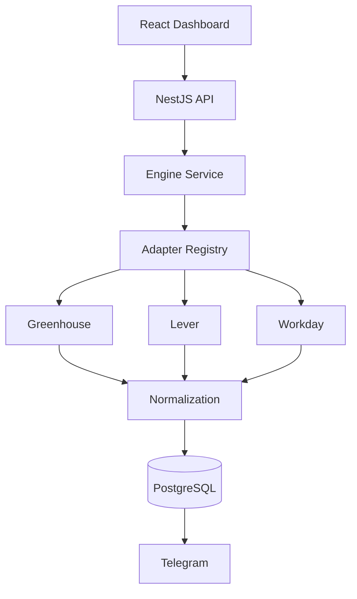
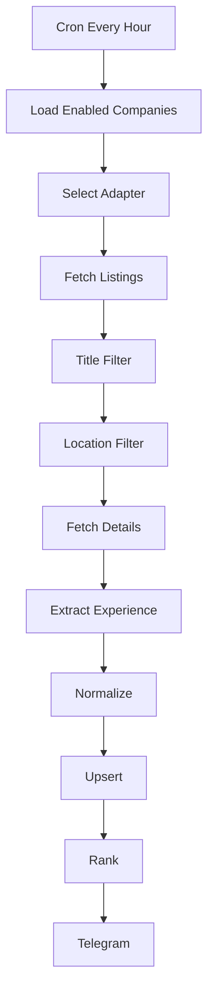

<div align="center">

<h1> HireScope</h1>


### A production-grade job discovery engine for Software Engineers

Discover newly posted engineering jobs from 200+ product companies **before they reach traditional job boards**.

**NestJS • TypeScript • PostgreSQL • Prisma • React • Docker**


</div>

---

# 📖 Table of Contents

- Motivation
- Features
- System Architecture
- Sync Pipeline
- ATS Adapter Architecture
- Tech Stack
- Database Design
- Filtering & Ranking
- Project Structure
- Engineering Decisions
- Performance
- Roadmap
- Setup

---

# 💡 Motivation

After sending **2000+ applications** and attending **28+ interviews**, I realized the biggest bottleneck wasn't interview preparation—it was discovering relevant openings before thousands of applicants.

Many product companies publish jobs on their ATS (Greenhouse, Lever, Workday, etc.) long before aggregators index them.

HireScope continuously discovers, filters, ranks, and notifies me about newly published jobs using only **public, legal, and ethical** endpoints.

---

# ✨ Features

- Hourly automated synchronization
- Modular ATS adapter architecture
- Greenhouse, Lever and Workday support
- Job normalization
- Experience extraction
- Intelligent title/location filtering
- Relevance scoring
- Telegram notifications
- Dashboard-ready REST APIs
- Fault-tolerant sync engine

---

# 🏗️ System Architecture



# 🔄 Synchronization Pipeline



# 🧩 Adapter Pattern

Every ATS implements the same contract.

```
BaseAdapter
├── GreenhouseAdapter
├── LeverAdapter
└── WorkdayAdapter
```

The Engine never contains provider-specific logic.

Adding a new ATS typically requires:
1. New adapter
2. Register adapter
3. Add company rows

---

# 🛠️ Tech Stack

| Category | Technologies |
|-----------|--------------|
| Backend | NestJS, Node.js, TypeScript |
| Frontend | React, Tailwind CSS |
| Database | PostgreSQL |
| ORM | Prisma |
| Scheduler | @nestjs/schedule |
| DevOps | Docker |
| Notifications | Telegram Bot API |

# 🗄️ Database

## Company

Stores ATS configuration including:
- board
- boardUrl
- requestBody
- applyBaseUrl
- priority
- enabled
- lastSyncedAt

## Job

Stores normalized jobs:
- externalJobId
- title
- company
- location
- remoteStatus
- experience
- score
- description
- applicationUrl

# 🎯 Filtering

- Relevant engineering titles only
- India / India Remote / Global Remote
- Experience extraction from descriptions
- Skip overly senior roles

# 📊 Ranking

Current inputs:
- Job title
- Experience
- Remote status
- Company relevance

Future:
- Skill matching
- Personalized preferences

# 📁 Project Structure

```text
backend/
 ├── engine
 ├── adapters
 ├── services
 ├── prisma
frontend/
docker-compose.yml
```

# ⚙️ Engineering Decisions

- Adapter Pattern
- Registry Pattern
- Config-driven integrations
- Database-first configuration
- Partial failure recovery
- Low request rate
- Public endpoints only

# 🚀 Performance

- Detail pages fetched only after filters
- Duplicate prevention
- Hourly scheduling
- Resilient syncs
- Continue after adapter failures

# 🔮 Roadmap

- Better Workday detail strategies
- Ashby support
- SmartRecruiters
- Rich analytics
- Dashboard improvements
- Production deployment
- Multi-user support

# ▶️ Local Setup

```bash
git clone <repo>
docker compose up -d
npm install
npx prisma migrate deploy
npm run start:dev
```

# .env setup


```bash
DATABASE_URL
TELEGRAM_BOT_TOKEN
TELEGRAM_CHAT_ID
```

# 📄 License

Portfolio project by **Rahul Ramachandran**.
