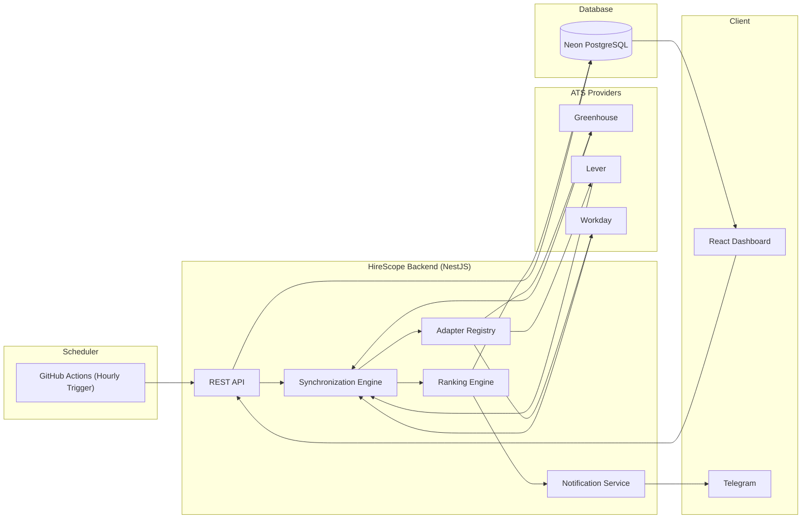
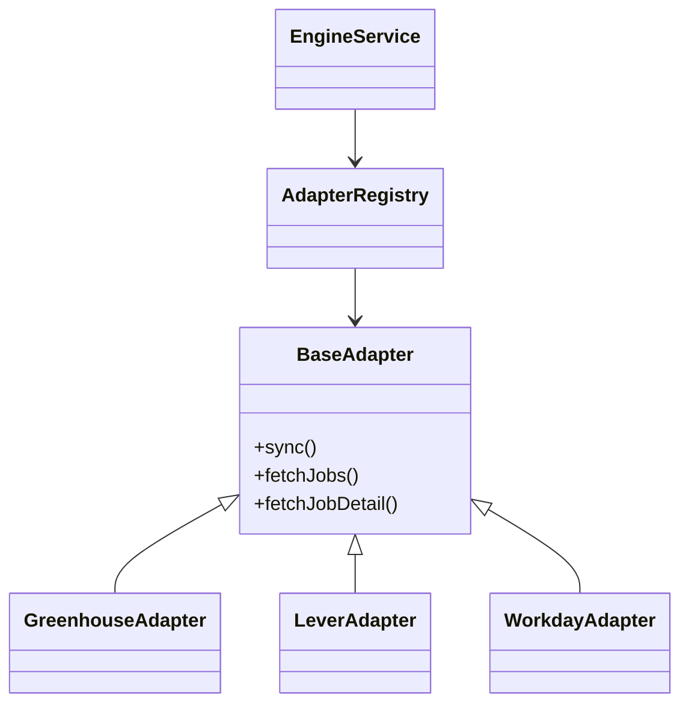
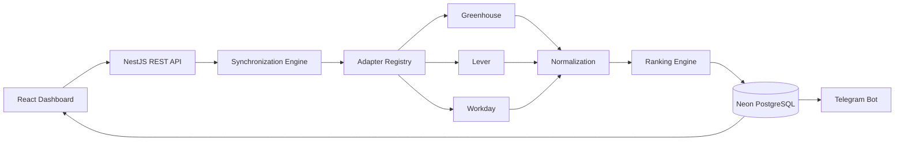

<div align="center">

#  HireScope 
https://switch-sync.vercel.app/
### Discover engineering jobs directly from company ATS platforms — before they appear on traditional job boards.

*A production-grade job discovery platform that continuously monitors public Applicant Tracking Systems (ATS), intelligently filters relevant software engineering opportunities, ranks them based on relevance, and delivers instant notifications through a scalable synchronization engine.*

<br>


<br><br>

**Built with NestJS • React • PostgreSQL • Prisma • TypeScript**

</div>

---

# 📖 Overview

HireScope is a full-stack job discovery platform designed to help software engineers discover newly published opportunities before they become saturated on traditional job boards.

Instead of relying on aggregators such as LinkedIn or Indeed, HireScope communicates directly with public Applicant Tracking Systems (ATS) used by product companies.

The platform continuously synchronizes job postings, filters only relevant software engineering roles, extracts structured information from unstructured job descriptions, ranks opportunities using a configurable scoring engine, and delivers real-time notifications.

The entire system is built around a modular adapter architecture, allowing new ATS providers to be integrated with minimal effort while keeping the synchronization engine completely provider-independent.

---

# 💡 Why I Built HireScope

While applying for software engineering positions, I noticed a recurring pattern.

Many companies publish openings on their careers page hours—or even days—before those jobs become visible on LinkedIn, Indeed, or other aggregators.

During that delay:

- Early applicants submit resumes directly through the company ATS.
- Job boards have not yet indexed the posting.
- Competition remains relatively low.

I wanted a system that could monitor these sources continuously and notify me the moment a relevant opportunity appeared.

That idea eventually evolved into **HireScope**.

Today, HireScope automatically monitors hundreds of companies, intelligently filters engineering roles, ranks opportunities by relevance, and sends instant notifications whenever a new matching position is discovered.

---

# ✨ Key Highlights

##  Product Features

- 🔍 Monitors **200+ product companies**
- ⚡ Automated hourly synchronization
- 🏢 Supports multiple ATS providers
  - Greenhouse
  - Lever
  - Workday
  - SmartRecruiters
  - Lever
- 🧩 Adapter-driven architecture for easy extensibility
- 🧠 Automatic experience extraction from job descriptions
- 📍 Intelligent location filtering
- 🎯 Engineering role classification
- 📈 Configurable relevance scoring engine
- 📬 Telegram instant notifications
- 🔄 Incremental synchronization
- 🛡️ Secure synchronization endpoint protected by secret token
- ⚙️ Production deployment on free cloud infrastructure

---

## 🏗 Engineering Highlights

- Adapter Registry Pattern
- Open/Closed Principle Architecture
- Incremental Synchronization
- Multi-stage Filtering Pipeline
- Fault-Tolerant Synchronization Engine
- Idempotent Sync Execution
- Configuration-Driven Discovery
- HTML Parsing & Data Normalization
- GitHub Actions Scheduler
- Production Deployment (Render + Neon)
- Prisma ORM
- Modular NestJS Architecture

---

# 📊 Current Scale

| Metric | Value |
|---------|-------|
| Companies Monitored | 200+ |
| Supported ATS Platforms | 5 |
| Synchronization Frequency | Every Hour |
| Deployment | Production |
| Scheduler | GitHub Actions |
| Database | Neon PostgreSQL |
| Backend | Render |
| Frontend | Vercel |
| Notification Channel | Telegram |
| Authentication | Sync Secret |
| Architecture | Adapter-Based |

---

# 📸 Application Preview


## Dashboard


---

## Job Listing


---

## Telegram Notification


---

## GitHub Actions Scheduler


---

## Overall System Architecture


```mermaid

flowchart LR

subgraph Scheduler
    GH["GitHub Actions (Hourly Trigger)"]
end

subgraph Backend["HireScope Backend (NestJS)"]

    API["REST API"]

    Engine["Synchronization Engine"]

    Registry["Adapter Registry"]

    Ranking["Ranking Engine"]

    Notify["Notification Service"]

end

subgraph ATS["ATS Providers"]

    GHATS["Greenhouse"]

    LV["Lever"]

    WD["Workday"]

end

subgraph Database

    PG[(Neon PostgreSQL)]

end

subgraph Client

    Dashboard["React Dashboard"]

    Telegram["Telegram"]

end

GH --> API

API --> Engine

Engine --> Registry

Registry --> GHATS
Registry --> LV
Registry --> WD

GHATS --> Engine
LV --> Engine
WD --> Engine

Engine --> Ranking

Ranking --> PG

PG --> Dashboard

Ranking --> Notify

Notify --> Telegram

Dashboard --> API
API --> PG
```


---

## Adapter Pattern


```mermaid
classDiagram

class EngineService

class AdapterRegistry

class BaseAdapter {
    +sync()
    +fetchJobs()
    +fetchJobDetail()
}

class GreenhouseAdapter
class LeverAdapter
class WorkdayAdapter

EngineService --> AdapterRegistry

AdapterRegistry --> BaseAdapter

BaseAdapter <|-- GreenhouseAdapter
BaseAdapter <|-- LeverAdapter
BaseAdapter <|-- WorkdayAdapter
```

---


# 🎯 The Problem

Traditional job boards introduce an unavoidable delay between when a company publishes a role and when candidates actually discover it.

```text
Company Careers Page

        │

        ▼

Applicant Tracking System
(Greenhouse / Lever / Workday)

        │
        │
        │  Hours
        ▼

LinkedIn
Indeed
Glassdoor

        │

        ▼

Thousands of Applications
```

By the time many engineers discover a job through traditional platforms, hundreds or even thousands of applications may already have been submitted.

For highly competitive software engineering positions, timing matters.

---

# 💡 The Solution

HireScope eliminates this delay by monitoring company ATS platforms directly.

Instead of waiting for third-party aggregators to index new jobs, HireScope continuously checks public ATS endpoints, detects newly published positions, processes them through an intelligent filtering pipeline, and stores only relevant engineering opportunities.

New jobs are immediately ranked, persisted to PostgreSQL, exposed through the REST API, and delivered via Telegram notifications.

The result is a significantly faster job discovery workflow built entirely on publicly available ATS APIs—without scraping authenticated content or violating platform access controls.

---

# 🌟 What Makes HireScope Different?

Unlike traditional job boards, HireScope focuses on engineering quality rather than quantity.

Before a job reaches the dashboard, it passes through multiple processing stages:

- Engineering role detection
- Location validation
- Duplicate elimination
- Experience extraction
- Data normalization
- Relevance scoring
- Notification pipeline

This dramatically reduces noise while surfacing opportunities that are actually relevant to software engineers.

---

# ⚡ Design Goals

HireScope was designed around a few core engineering principles.

### Extensibility

Supporting a new ATS should require minimal code changes.

---

### Reliability

Failure of one ATS provider should never interrupt synchronization for the others.

---

### Performance

Avoid unnecessary API requests through incremental synchronization and intelligent filtering.

---

### Maintainability

Separate provider-specific logic from business logic using a modular adapter architecture.

---

### Scalability

Adding new companies should require configuration—not engine modifications.

---

### Production Readiness

Deploy entirely on free cloud infrastructure while maintaining automated hourly synchronization and secure API access.

---

# 🎯 Why HireScope?

Most developers rely on LinkedIn, Indeed, or other job aggregators to discover new opportunities.

The problem?

By the time a job appears there, **hundreds or even thousands of engineers have already applied.**

HireScope solves this by monitoring **public Applicant Tracking Systems (ATS)** used directly by product companies and discovering newly published engineering jobs **before they propagate to traditional job boards.**

Instead of scraping LinkedIn or relying on third-party aggregators, HireScope communicates directly with public ATS endpoints exposed by providers such as:

- Greenhouse
- Lever
- Workday
- Ashby
- SmartRecruiters

This significantly reduces the discovery delay and gives job seekers access to fresh opportunities as soon as they become available.

---

# 🚀 Key Features

### 🔍 Direct ATS Monitoring

Continuously monitors engineering job openings from hundreds of product companies using their public ATS APIs.

---

### ⚡ Hourly Automated Synchronization

Runs every hour using GitHub Actions to discover newly published positions while keeping infrastructure costs at zero.

---

### 🏢 Multi-ATS Architecture

Supports multiple ATS providers through a modular adapter architecture.

Current providers:

- ✅ Greenhouse
- ✅ Lever
- ✅ Workday
- ✅ Ashby
- ✅ SmartRecruiters

---

### 🎯 Intelligent Engineering Job Filtering

Filters thousands of jobs to retain only relevant software engineering opportunities.

Examples:

✅ Backend Engineer

✅ Software Engineer

✅ Full Stack Engineer

✅ Frontend Engineer

✅ Platform Engineer

❌ Sales

❌ HR

❌ Marketing

❌ Designer

❌ Principal / Staff roles (configurable)

---

### 📍 Smart Location Filtering

Automatically filters locations based on predefined preferences.

Supports:

- India
- Remote (India)
- Global Remote

Ignores:

- USA Onsite
- Germany Onsite
- Singapore Onsite

This dramatically reduces unnecessary processing while keeping only relevant opportunities.

---

### 🧠 Automatic Experience Detection

Most ATS providers expose experience requirements only inside job descriptions.

HireScope parses and normalizes experience values such as:

- 2–4 Years
- 3+ Years
- Minimum 5 Years
- At least 2 Years

The extracted values become searchable and filterable.

---

### 📈 Relevance Ranking Engine

Every discovered job receives a relevance score based on multiple signals including:

- Job title
- Experience level
- Required skills
- Remote availability
- Source quality
- Job freshness

This allows higher quality opportunities to naturally surface first.

---

### 🔄 Incremental Synchronization

Instead of processing thousands of historical jobs every hour, HireScope performs incremental synchronization.

Once an already-known job is encountered, processing stops immediately.

Benefits:

- Fewer API requests
- Faster synchronization
- Lower bandwidth usage
- Lower infrastructure cost

---

### 📲 Instant Telegram Notifications

Newly discovered jobs are pushed directly to Telegram as soon as they are indexed.

No polling required.

---

### ☁️ Fully Cloud Hosted

Production deployment uses only free-tier infrastructure.

| Service | Platform |
|----------|----------|
| Frontend | Vercel |
| Backend | Render |
| Database | Neon PostgreSQL |
| Scheduler | GitHub Actions |
| Notifications | Telegram Bot |

---

# 🏗 System Architecture


```mermaid
flowchart LR

User["React Dashboard"]

API["NestJS REST API"]

Engine["Synchronization Engine"]

Registry["Adapter Registry"]

GH["Greenhouse"]

LV["Lever"]

WD["Workday"]

Normalize["Normalization"]

Rank["Ranking Engine"]

DB[(Neon PostgreSQL)]

Telegram["Telegram Bot"]

User --> API

API --> Engine

Engine --> Registry

Registry --> GH
Registry --> LV
Registry --> WD

GH --> Normalize
LV --> Normalize
WD --> Normalize

Normalize --> Rank

Rank --> DB

DB --> User

DB --> Telegram
```

---

# 🔄 End-to-End Synchronization Flow

Every scheduled synchronization follows the same pipeline.

```text
Scheduler

      │

      ▼

Load Enabled Companies

      │

      ▼

Choose ATS Adapter

      │

      ▼

Fetch Job Listings

      │

      ▼

Title Filter

      │

      ▼

Location Filter

      │

      ▼

Already Indexed?

      │

      ├────────────► Yes

      │                │

      │                ▼

      │          Stop Processing

      │

      ▼

Fetch Job Details

      │

      ▼

Extract Experience

      │

      ▼

Normalize Data

      │

      ▼

Calculate Relevance Score

      │

      ▼

Persist into PostgreSQL

      │

      ▼

Telegram Notification
```

---

# 🧩 Modular ATS Adapter Architecture

One of the core engineering goals behind HireScope was extensibility.

Instead of tightly coupling ATS-specific logic into the synchronization engine, every provider implements a shared abstraction.

```text
BaseAdapter

├── GreenhouseAdapter

├── LeverAdapter

├── WorkdayAdapter

└── Future Providers
      └── 
```

The synchronization engine never needs to know **how** an individual ATS works.

Adding support for a new provider generally requires only three steps:

1. Implement the adapter
2. Register the adapter
3. Add company configuration

No engine modifications are required.

This keeps the architecture scalable as additional ATS providers are introduced.

---

# ⚙️ Engineering Optimizations

## Incremental Processing

Instead of fetching every historical job on every synchronization cycle:

```text
Newest Job

↓

Already Exists?

↓

YES

↓

Stop
```

This dramatically reduces synchronization time for companies with large historical datasets.

---

## Multi-stage Filtering

Rather than fetching every job description immediately:

```text
650 Jobs

↓

Title Filter

↓

120 Jobs

↓

Location Filter

↓

38 Jobs

↓

Detail Requests
```

Only relevant jobs require expensive detail-page requests.

This reduces network traffic by approximately **90%**.

---

## Fault Tolerance

Each ATS provider is isolated.

If one provider experiences downtime:

```text
Greenhouse ✅

Lever ✅

Workday ❌

↓

Synchronization Continues
```

The failure of one provider never affects the remaining synchronization process.

---

## Configuration Driven Design

Company-specific configuration lives inside the database.

Configuration includes:

- ATS Provider
- Board Identifier
- API Endpoint
- Career URL
- Request Payload
- Enabled Status
- Priority
- Last Synchronized Time

Adding a new company usually requires **zero code changes**.

---

# 🗄️ Database Design

HireScope uses PostgreSQL as its primary datastore with Prisma ORM for type-safe database access.

The database is intentionally kept simple, focusing on configuration-driven synchronization and efficient job querying.

## Entity Relationship Overview

```text
+--------------------+
|      Company       |
+--------------------+
| id                 |
| name               |
| ats                |
| board              |
| boardUrl           |
| careerUrl          |
| homepage           |
| requestBody        |
| priority           |
| enabled            |
| lastSyncedAt       |
+---------+----------+
          |
          | 1
          |
          | *
+---------v----------+
|        Job         |
+--------------------+
| id                 |
| externalJobId      |
| companyId          |
| title              |
| location           |
| description        |
| experience         |
| employmentType     |
| remoteStatus       |
| score              |
| source             |
| applyUrl           |
| postedAt           |
| createdAt          |
+--------------------+
```

---

# 📡 REST API

HireScope exposes a clean REST API that powers the dashboard and synchronization engine.

## Jobs

```http
GET /jobs
```

Returns paginated job listings.

---

```http
GET /jobs/summary
```

Returns dashboard summary statistics.

---

```http
GET /jobs/facets
```

Returns filter metadata such as:

- Companies
- Experience
- Location
- ATS Provider

---

```http
POST /jobs/:id/status
```

Updates job status.

Examples:

- Applied
- Interested
- Ignored

---

## Synchronization

```http
POST /engine/sync
```

Triggers synchronization across every enabled ATS.

Protected using a Bearer token.

---

```http
POST /engine/sync/:provider
```

Synchronizes a single ATS provider.

Example:

```
POST /engine/sync/greenhouse
```

Useful for testing and debugging individual adapters.

---

# 📂 Project Structure

```text
HireScope

├── backend
│
│   ├── src
│   │
│   ├── career
│   ├── company
│   ├── discovery
│   ├── engine
│   ├── jobs
│   ├── notifications
│   ├── ranking
│   ├── scheduler
│   │
│   ├── sources
│   │     ├── greenhouse
│   │     ├── lever
│   │     ├── workday
│   │     └── registry
│   │
│   ├── common
│   └── prisma
│
├── frontend
│
│   ├── components
│   ├── pages
│   ├── hooks
│   ├── services
│   ├── api
│   └── types
│
├── .github
│     └── workflows
│
└── README.md
```

---

# 🛠 Tech Stack

## Backend

- NestJS
- Node.js
- TypeScript
- Prisma ORM
- PostgreSQL
- Axios
- Class Validator
- Telegram Bot API

---

## Frontend

- React 19
- TypeScript
- Vite
- Tailwind CSS
- React Router
- Axios

---

## Infrastructure

- Render
- Neon PostgreSQL
- GitHub Actions
- Docker
- Git
- GitHub

---

# 🚀 Running Locally

## Clone Repository

```bash
git clone https://github.com/<username>/switch-sync.git

cd hirescope
```

---

## Backend

```bash
cd backend

npm install

docker compose up -d

npx prisma migrate deploy

npm run start:dev
```

Backend runs at

```
http://localhost:3000
```

---

## Frontend

```bash
cd frontend

npm install

npm run dev
```

Frontend runs at

```
http://localhost:5173
```

---

# 🔑 Environment Variables

## Backend

```env
DATABASE_URL=

PORT=3000

SYNC_SECRET=

TELEGRAM_BOT_TOKEN=

TELEGRAM_CHAT_ID=
```

---

## Frontend

```env
VITE_API_BASE_URL=
```

---

# 🚀 Deployment

HireScope is deployed entirely using free cloud services.

| Component | Platform |
|------------|----------|
| Frontend | Vercel |
| Backend | Render |
| Database | Neon PostgreSQL |
| Scheduler | GitHub Actions + Cron jobs org |
| Notifications | Telegram Bot API |

Deployment is fully automated and designed to minimize operational cost while remaining production-ready.

---

# 🧪 Future Improvements

Planned features include:

### Product Features

- Resume Matching
- Personalized Job Ranking
- Company Watchlists
- Saved Searches
- Email Notifications
- Multi-user Authentication
- SaaS Dashboard
- Recruiter Analytics
- AI-powered Job Summaries

---

# 💡 Engineering Challenges & Lessons Learned

Building HireScope involved significantly more than consuming public APIs.

Some of the key engineering challenges included:

- Designing a scalable adapter architecture for multiple ATS providers.
- Normalizing completely different API payloads into a unified data model.
- Building an incremental synchronization engine to reduce unnecessary API calls.
- Extracting structured experience information from inconsistent job descriptions.
- Implementing a ranking engine to prioritize the most relevant opportunities.
- Handling provider failures without interrupting the synchronization pipeline.
- Building a production deployment using only free cloud infrastructure.
- Optimizing synchronization performance using multi-stage filtering.

The project evolved from a simple job aggregator into a modular backend platform capable of supporting additional ATS providers with minimal engineering effort.

---

# 📈 Project Statistics

Current capabilities:

- 🏢 200+ Product Companies
- 🔄 Hourly Automated Synchronization
- 🌐 3 ATS Providers Supported
- ⚡ Incremental Sync Engine
- 📊 Intelligent Job Ranking
- 📍 Smart Location Filtering
- 🧠 Automatic Experience Extraction
- 📲 Telegram Notifications
- ☁️ Production Deployment

---

# 👨‍💻 About the Author

## Rahul Ramachandran

Full Stack Software Engineer passionate about building scalable backend systems and solving real-world problems through software.

HireScope was built after personally experiencing the challenges of applying to product companies and realizing that discovering opportunities early can make a significant difference during a job search.

The project reflects interests in:

- Backend Engineering
- Distributed Systems
- API Design
- System Architecture
- Automation
- Developer Productivity

If you found this project interesting, feel free to connect or reach out.

---

<div align="center">

## ⭐ Support the Project

If you found HireScope useful or interesting, consider giving it a ⭐ on GitHub.

It helps the project reach more developers and motivates future improvements.

---

**Built with ❤️ using NestJS • React • PostgreSQL • Prisma • TypeScript**

</div>
